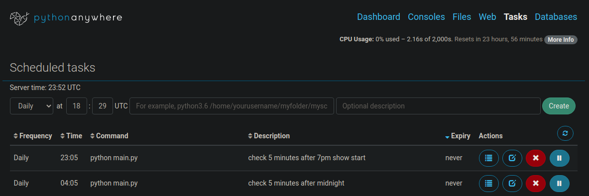

# BoyHarsherTickets

*This is a little web scraper that will alert me via email when tickets go on sale for this Boy Harsher concert I want to go to!*

## General Concept
**Here's the ticket website:**
> 

**I specifically want to know when the following span**
> 

**is no longer disabled because that should mean i'm able to buy tickets!**

## What i'm using to host and run the web scraping chron job
*Python Anywhere*
> 

*Scheduled Checks*

| time (MST) | reasoning |
| ---- | --------- |
| 8 am | when i wake up |
| 4 pm | random middle of the day check|
| 5:05 pm |when show is scheduled to start|
|12:05 am | ¯\\_(ツ)_/¯ why not |

### why am I using python anywhere?
- cheap ($5/month)
- already has the modules and version of python I need
- easy to schedule chron jobs

### About the emailing function
- the 'send_mail' function uses a gmail that does not have duel authentication and has the 'Access for less secure apps setting' turned on so I can use python to send emails. For security puruposes I created a dummy email account just for sending mail with python

